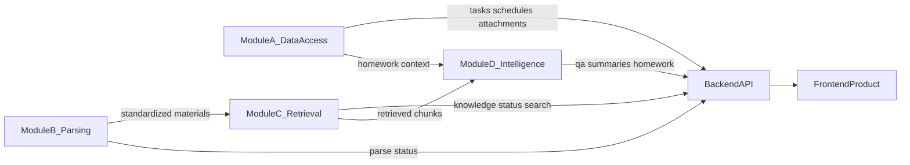

# E 模块架构说明

E 模块负责产品平台、前端与总集成。A/B/C/D 保持各自核心实现，E 只提供统一产品入口、模块适配、状态可视化、部署和演示闭环。

## 职责边界

| 模块 | 负责内容 | E 的对接方式 |
| --- | --- | --- |
| A | 网络学堂、邮箱、教务/Info、任务中心、公告变更、课件下载、作业状态、定时同步 | 读取任务、课表、附件、同步状态，展示在 Dashboard 和任务中心 |
| B | PDF/PPT/Word/Markdown/文本/图片/音视频解析，输出标准化资料与解析状态 | 读取资料列表、解析状态、失败原因，展示在资料页 |
| C | 知识库、向量索引、关键词索引、元数据过滤、混合检索、Retrieval API | 接入知识库状态与检索 API，展示系统状态并供 D 使用 |
| D | 课程问答、引用溯源、资料总结、作业助手、多轮问答 | 接入问答、总结、作业助手结果，展示在智能应用页面 |
| E | Git 协作、后端骨架、数据库基础模型、前端、适配器、部署、Demo | 不深入实现 A/B/C/D 的核心算法 |

## 目录规划

```text
Learning-Assistant/
├── backend/              # FastAPI 统一 API 与模块适配器
│   └── app/
│       ├── adapters/     # A/B/C/D 适配器，隐藏各模块实现差异
│       ├── models.py     # E 层 API 请求/响应模型
│       └── main.py       # REST API 入口
├── frontend/             # React/Vite 产品前端
│   └── src/
│       ├── api.ts        # 调用 E 统一 API
│       └── App.tsx       # Demo 页面
├── docs/                 # 接口契约、架构说明、演示脚本
├── src/                  # 现有 A/B 核心逻辑与数据契约
├── scripts/              # 采集、解析、启动、验收脚本
└── storage/              # 本地 SQLite、JSONL、附件、资料解析结果
```

## 数据流



## 后端原则

- 前端只调用 `backend` 的统一 API。
- A/B 已有接口或 JSONL 产物直接适配，不重复实现内部逻辑。
- C/D 未完成时先提供 Mock 适配器，字段保持与接口契约一致。
- 每条前端展示数据保留 `source_module` 或等价来源字段，方便联调和答辩说明。
- 错误响应统一为 `code`、`message`、`source_module`、`detail`。

## 前端原则

- Dashboard 体现完整产品闭环，而不只是单个模块页面。
- 任务中心突出 A 的任务数据和作业状态。
- 资料页同时展示 B 的解析状态和 C 的知识库状态。
- 问答、总结、作业页统一通过 D 的接口展示智能应用能力。
- 缺失接口使用 Mock 时，页面应明确显示当前模块状态为 `mock`。
